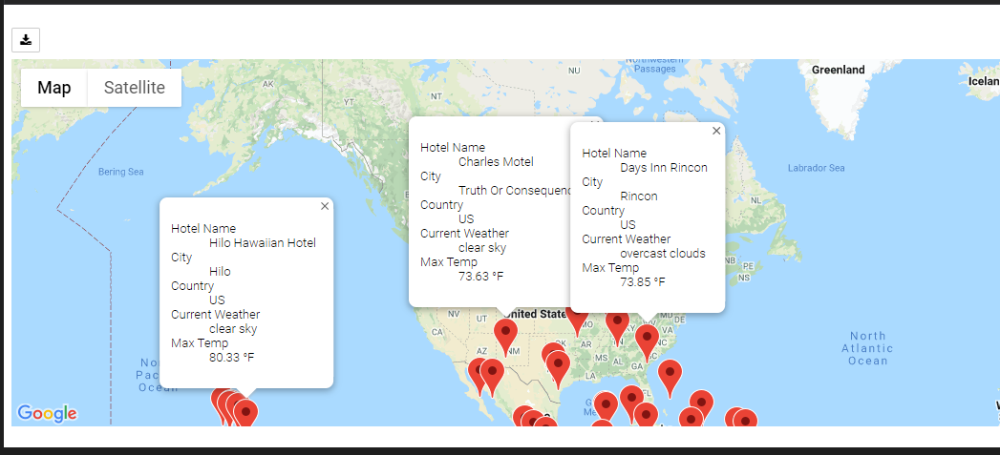

# World Weather Analysis
## Purpose

This analysis demonsrates skills in calling APIs, reading JSON data, and using google map APIs.

## Deliverable 1

This deliverable required calling the OpenWeather API and creating a database of current weather for several hundred cities around the Earth. The data is then formatted into a table and saved as a CSV file.

The database file can be found [here](./Weather_Database/WeatherPy_Database.csv).

## Deliverable 2

In this deliverable, the Juypter Notebook prompts the user for maximum and minimum teperature ranges. The code then queries the the weather database created in deliverable 2 and returns cities within provided temperature range.

### Hotels
Using the cities that are returned. The code then makes a call to the Google nearby API and returns the nearest hotel.

### Map
A map is then displayed showing the filtered cities with a label that shows the hote name, city, country, maximum temperature, and current weather conditions.

## Deliverable 3

In this deliverable, a simulated itinerary is created using for cities. The itinerary is assumed to be a round trip. An API call is then made to Google directions to get the planned route.

### Itinerary Map

### Hotel and Weather Information Map

A second call to Google maps API, using the 4  selected cities, creates a map with markers and labels reporting hotel and current weather.

